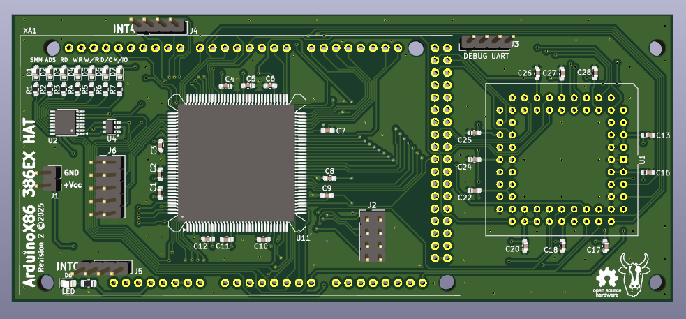

## ArduinoX86 386EX + 387SX HAT

This is a HAT for the 386EX CPU that includes a socket for the 387SX.
The 386EX is a low-voltage variant of the 386 with a 16-bit data bus, intended for embedded applications.

This HAT has external power pins. You may connect a 3.3V power source to the pins. I recommend using Dupont connectors.

You may find that the CPU runs even without external power. This is due to the CMOS process - many CMOS CPUs can power
themselves by sinking current from any input pin. Correct operation in this state is not guaranteed.

This HAT should be compatible with the Arduino Due and GIGA. If using a Due, do not supply more than 3.3V to the HAT.

Unsoldered new-old-stock 386EX chips are often available on eBay. If using a donor board, a hot plate or hot-air
station will be necessary to successfully remove the CPU without damage.

This HAT adds new features over the original:

- A PLCC68 socket has been added for the 387SX FPU and appropriate lines connected including PEREQ and ERROR
- The SMI and SMIACT pins have been connected
- The JTAG ports have been run out to a 2x4 header
- The first Asynchronous serial port has been run out to a 2x5 header (Serial0)
- The first 8 external INTR lines (INTR0-INTR7) have been run out to separate 1x4 headers
- 7 status LEDs have been added that will report the status of SMIACT, ADS, RD, WR, W/R, C/M and M/IO.

> [!WARNING]  
> Successfully assembling this board requires advanced soldering skills. A solder mask, paste and hot plate are
> recommended, or solid experience in drag-soldering techniques.

## BOM

- This board has not been ordered and tested. I do not recommend being the first to do so!
- TBD