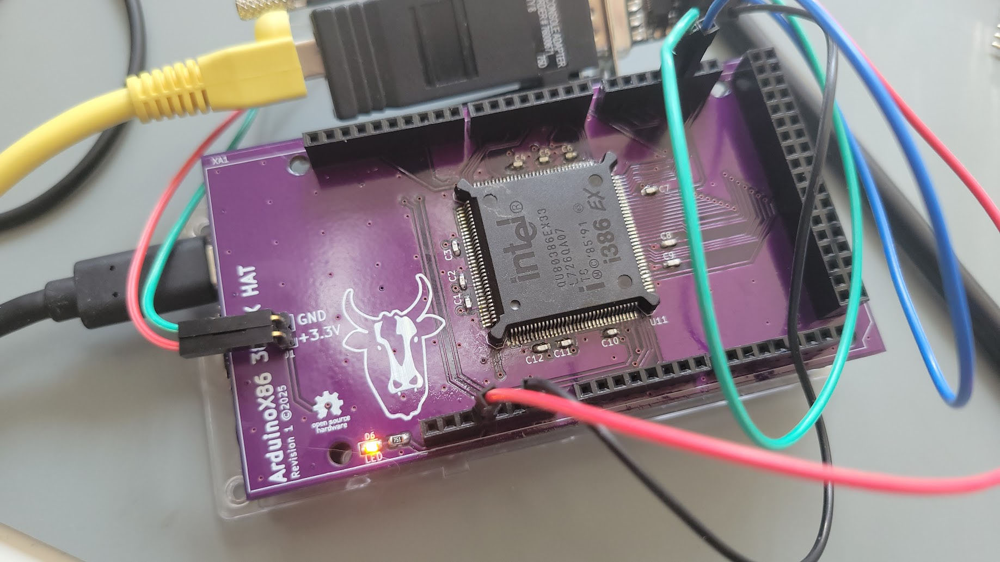

## ArduinoX86 386EX Shield

This is a shield for the 386EX CPU. The 386EX is a low-voltage variant of the 386 with a 16-bit data bus, intended for
embedded applications.

This shield has external power pins. You may connect a 3.3V or 5V power source to the pins.
I recommend using Dupont connectors.

In my observation, 5V 386EX CPUs seem to run fine at 3.3V as well, although this may not be the case at higher clock
rates.

You may find that the CPU runs even without external power. This is due to the CMOS process - many CMOS CPUs can power
themselves by sinking current from any input pin. Correct operation in this state is not guaranteed.

This shield should be compatible with the Arduino Due and GIGA. If using a Due, do not supply more than 3.3V to the HAT.

Unsoldered new-old-stock 386EX chips are often available on eBay. If using a donor board, a hot plate or hot-air
station will be necessary to successfully remove the CPU without damage.

> [!WARNING]  
> Successfully assembling this board requires advanced soldering skills. A solder mask, paste and hot plate are
> recommended, or solid experience in drag-soldering techniques.

## BOM

- (1x) 386EX CPU in PQFP-132 footprint
- (12x) 0603 0.047uf bypass capacitors
- (1x) 1x2 2.54mm pin headers (horizontal or vertical, trim to size)
- A set of Arduino MEGA-footprint stacking headers
  https://www.amazon.com/Treedix-Stacking-Headers-Stackable-Compatible/dp/B08G4FGBPQ
- (1x) 750Ohm resistor (for LED)
  https://www.mouser.com/ProductDetail/667-ERA-6AED751V

- (1x) Any 0805 ~2V LED of your choice with 1.8-1.9mA forward current
    - https://www.mouser.com/ProductDetail/604-APTD2012LCGCK (Green)
    - https://www.mouser.com/ProductDetail/604-APT2012LSECKJ4RV (Orange)

- RS232 board for debug output such as MAX3232 or the like