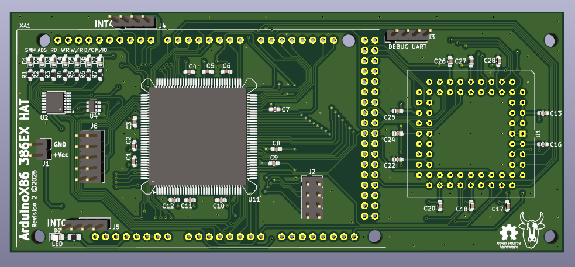

## ArduinoX86 386EX + 387SX Shield

> [!WARNING]  
> This shield is deprecated and is included only for reference.
> I recommend using the V4 386EX shield with the stacking 387SX shield.

This is a shield for the 386EX CPU that includes a socket for the 387SX.
The 386EX is a low-voltage variant of the 386 with a 16-bit data bus, intended for embedded applications.

This shield has external power pins. You should connect either a 5V or 3.3V power source to the pins. I recommend using
Dupont connectors. If you have a 387SX in the PLCC68 socket the board is unlikely to run properly without external
power.

This shield should be compatible with the Arduino Due and GIGA. If using a Due, do not supply more than 3.3V to the
external power pins or you will damage your Arduino.

Unsoldered new-old-stock 386EX chips are often available on eBay. If using a donor board, a hot plate or hot-air
station will be necessary to successfully remove the CPU without damage.

This shield adds new features over the original:

- A PLCC68 socket has been added for the 387SX FPU and appropriate lines connected including PEREQ and ERROR
- The SMI and SMIACT pins have been connected
- The JTAG ports have been run out to a 2x4 header
- The first Asynchronous serial port has been run out to a 2x5 header (Serial0)
- The first 8 external INTR lines (INTR0-INTR7) have been run out to separate 1x4 headers
- 7 status LEDs have been added that will report the status of SMIACT, ADS, RD, WR, W/R, C/M and M/IO.

> [!WARNING]  
> Successfully assembling this board requires advanced soldering skills. A solder mask, paste and hot plate are
> recommended, or solid experience in drag-soldering techniques.

## BOM

- I don't recommend building this board. See the V4 board instead.