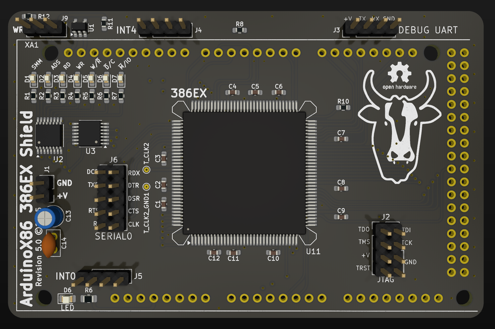

## ArduinoX86 386EX Shield V4

This is the latest shield design for the 386EX CPU. It supports the addition of a 387SX FPU via stacking headers.
The 386EX is a low-voltage variant of the 386 with a 16-bit data bus, intended for embedded applications.

This shield has external power pins. You may connect a 3.3V or 5V power source to the pins. I recommend using Dupont
connectors.

You may find that the CPU runs even without external power. This is due to the CMOS process - many CMOS CPUs can power
themselves by sinking current from any input pin. Correct operation in this state is not guaranteed.

This shield should be compatible with the Arduino Due and GIGA. If using a Due, do not supply more than 3.3V to the
external power pins, or you will damage your Arduino Due.

Unsoldered new-old-stock 386EX chips are often available on eBay. If using a donor board, a hot plate or hot-air
station will be necessary to successfully remove the CPU without damage.

This shield adds new features over the original:

- PEREQ and ERROR pins have been connected to support stacking a 387SX
- The SMI and SMIACT pins have been connected
- The JTAG ports have been run out to a 2x4 header
- The first Asynchronous serial port has been run out to a 2x5 header (Serial0)
- The first 8 external INTR lines (INTR0-INTR7) have been run out to separate 1x4 headers
- 7 status LEDs have been added that will report the status of SMIACT, ADS, RD, WR, W/R, C/M and M/IO.

Improvements over the previous design include:

- Series termination resistor on the clock line
- Optional filter caps on the external power connector
- Larger Schmitt-triggered inverter chip to invert the D/C and M/IO LED logic states
- Test probe pads for the clock line near the CPU
- I2C EEPROM for automatic board identification and write-protect jumper

> [!WARNING]  
> Successfully assembling this board requires advanced soldering skills. A solder mask, paste and hot plate are
> recommended, or solid experience in drag-soldering techniques.

## BOM

- TBD